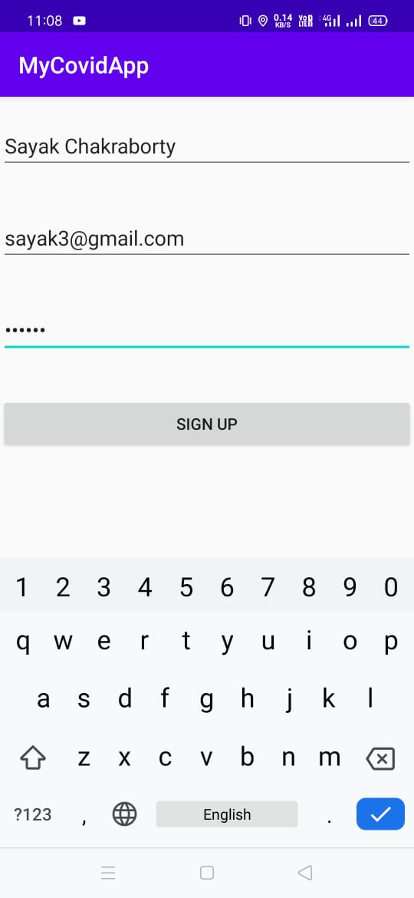
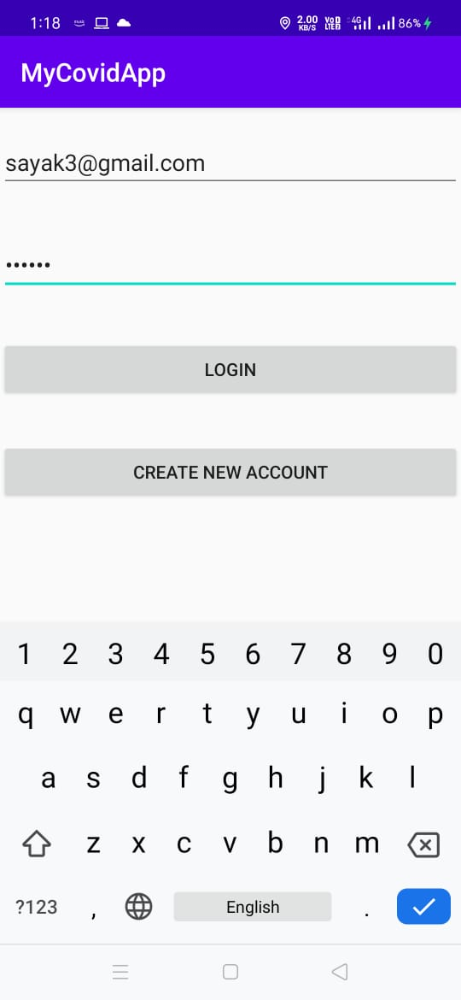
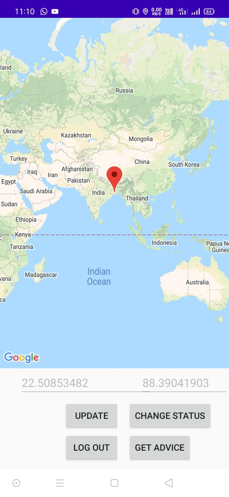
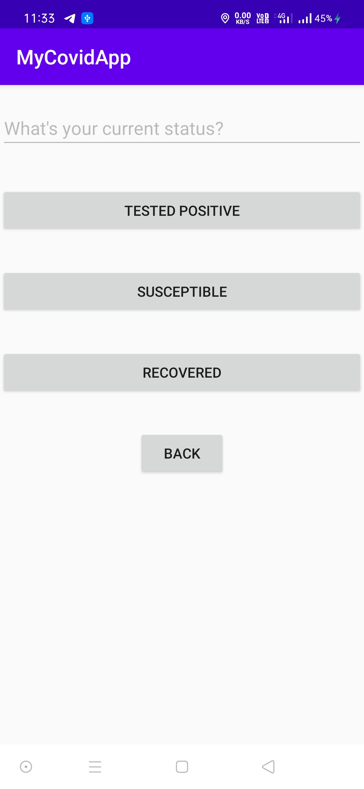
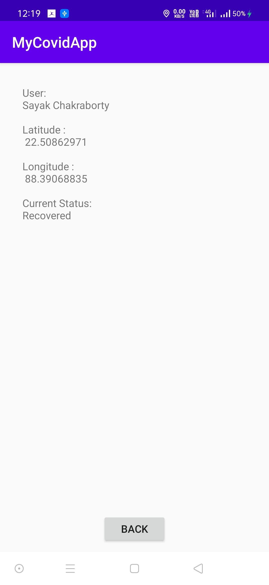
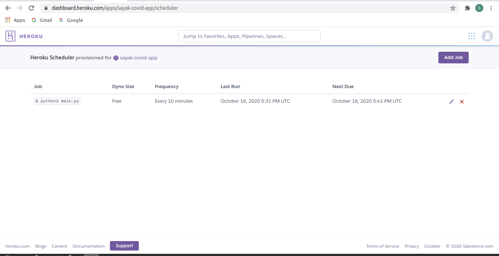

# MyCovidApp

The user can use this app to find the location where they can go safely depending on their current health status.

## A Walkthrough of the app
* Signup/Login - Enter user datails(password should be atleast 6 characters long) to start using the app.
</img>
</img>
* Update Location - Switch on the GPS so that location is automatically upadated to the Firebase Realtime Database. User can also do it explicitly by clicking the "UPDATE" button.
</img>
* Change Status - User can change their status if the want to "TESTED POSITIVE" if they have been tested positive for COVID-19, or to "SUSCEPTIBLE" if they haven't been infected yet and "RECOVERED" if they have recovered from COVID-19.
</img>
* Get Advice - User can click on the "GET ADVICE" button to get the value of the optimized Latitude and Longitude values.
</img>
* Log Out - Finally the user can log out by clicking the "LOG OUT" button.
</img>

## Backend
* Firebase Realtime Database has been used to store the user data
</img>
</img>
* The python scripts doing the optimization has been hosted in Heroku. The optimization scripts is being run every 10 minutes by Heroku Scheduler
</img>
